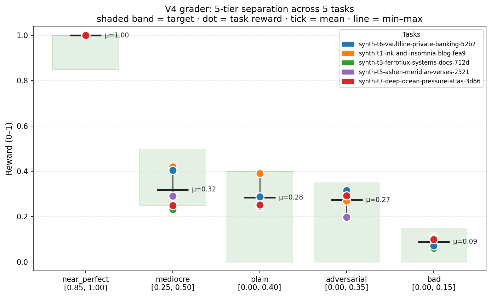
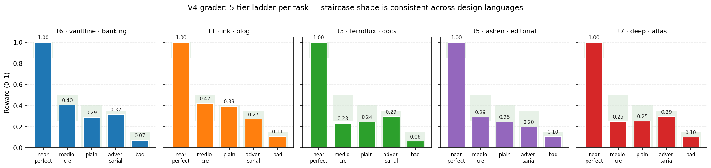
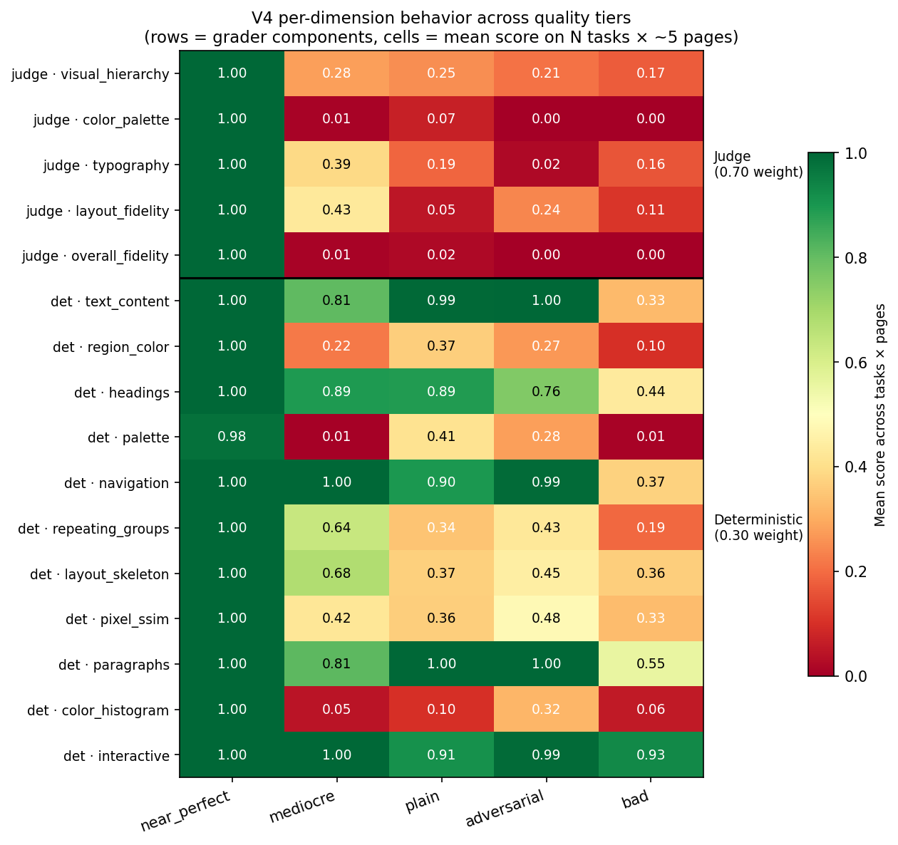
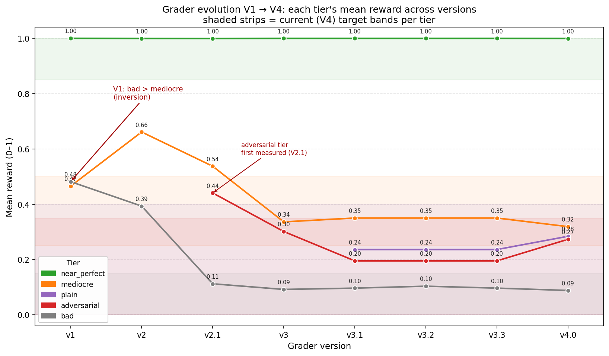

# How the grader works and how well it works

This document answers two questions:

1. **How well does the grader score the results?**
2. **Why do higher grader scores correspond to better website replications?**

Short version: the grader produces one number between 0 and 1 per task. We
tested it by feeding it 25 hand-built outputs whose quality we already
knew — 5 different websites × 5 deliberately-different quality levels —
and checking the scores fell where they should. Every quality level
landed in its expected range on every website, with no out-of-order
results.

## 1. What the grader is

The grader lives at [`bench-generator/templates/tests/score.py`](../templates/tests/score.py)
and is currently at version V4. It takes the HTML pages an agent
produced and the reference HTML pages for that task, renders both, and
returns a final reward in `[0, 1]`. That reward is a weighted combination
of two halves:

```
final_reward = 0.30 × deterministic_score
             + 0.70 × judge_score
```

**The deterministic half (30%)** is pure Python — no AI, no model calls.
For each page it opens both versions in a headless browser at three
viewports (desktop 1440×900, tablet 768×1024, phone 390×844), takes
screenshots, extracts a structured DOM description, and runs 11 checks
comparing reference vs agent: text content, headings, paragraphs, nav
links, repeating groups, palette, region colors, color histograms, pixel
SSIM, layout skeleton, interactive elements. Each check produces a
[0, 1] score; they're weighted (`text_content` has the biggest weight
at 0.32 — see `ASPECT_TARGET_WEIGHTS` at
[`grader_versions/v4.0/score.py`](../scoring_calibration/grader_versions/v4.0/score.py)
line 150) and summed. A multiplicative text gate (floor 0.30) caps the result when
the visible text doesn't match — a page full of lorem ipsum can never
score high regardless of how nice the layout is.

**The judge half (70%)** is Claude Opus 4.7 with vision. For each page
the grader makes 3 API calls (the ensemble). Each call sends all six
screenshots of that page in a single prompt — reference desktop +
tablet + phone *and* agent desktop + tablet + phone — and asks for a
1–5 Likert score on five qualities: visual hierarchy, color palette,
typography, layout fidelity, and overall fidelity. The median across
the 3 ensemble calls is used, because language models can be slightly
inconsistent run-to-run.

**Why this 30/70 split.** The two halves catch different kinds of
failures. Code-only checks miss when something is "structurally right
but visually broken" — Comic Sans + neon colors on the right HTML
elements scores high on every deterministic aspect but obviously doesn't
look like the reference. The judge catches this. The judge in turn can
be fooled by pages that "look right" but have the wrong text content
(lorem ipsum) — the deterministic text-content check + text gate catch
*that*. Together they cover failure modes neither half can catch alone.

## 2. Why higher grades mean better replications

There are three things to argue here:

**Every piece of the score is a real component of replication quality.**
The judge directly answers five questions a human reviewer would ask
(does the hierarchy work, is the palette on-brand, do the typefaces
match, does the layout track, is it broadly recognizable as the same
design). Each deterministic check measures one concrete thing the agent
either got right or wrong — same text? same headings? same nav links?
same palette? same regional color layout? Nothing here is a proxy or a
correlate of something unrelated.

**A win on one axis can't carry a loss on another.** Suppose the agent
embeds the reference screenshot as an `` and renders nothing else.
The judge sees a perfect render and scores 1.0 — but the deterministic
side reads the agent's HTML and finds no headings, no paragraphs, no
nav, and `text_content` lands at near zero. Conversely, an agent that
ships valid HTML with lorem ipsum and Comic Sans gets credit from
`text_content`'s lorem-vs-reference comparison but the judge tanks the
typography and overall-fidelity criteria. Both halves have to be
roughly right for the total to be high; faking one of them isn't enough.

**Section 3 onward is the empirical check.** The next sections feed the
grader 25 outputs whose quality we already know and look at where the
scores land. If the grader gives lower scores to worse outputs across
the board, the architectural argument above is also backed by data; if
it doesn't, the architecture isn't doing what we claimed.

## 3. The calibration: 5 quality levels per task

To test the grader we needed outputs whose quality we already knew.
Instead of paying humans to grade hundreds of agent outputs, we wrote
[`scoring_calibration/degrade.py`](../scoring_calibration/degrade.py)
which takes the reference HTML for a task and produces 5 deliberately-
different versions:

| Tier | What it is | What good grader should score |
|---|---|---|
| **near_perfect** | Verbatim copy of the reference. The "oracle" upper bound. | ≥ 0.85 |
| **mediocre** | Wrong colors (4-color generic palette: gray/blue/green/amber — `_MEDIOCRE_PALETTE` in `degrade.py`), all `font-family` declarations forced to `Arial, Helvetica, sans-serif`, every other `<p>` element's text replaced with lorem ipsum (~50% of paragraphs). Structure, semantic tags, and `@media` queries kept intact. Models "low-effort agent — got the bones right, brand wrong." | 0.25–0.50 |
| **plain** | All styling stripped. No `<style>` blocks, no `<link rel=stylesheet>`, no inline styles, no Google Fonts. Browser default rendering (Times New Roman, no colors, no layout). Models "agent ignored the visual reference entirely." | 0.00–0.40 |
| **adversarial** | Every DOM primitive preserved exactly — all text, headings, paragraphs, links, nav, repeating groups. *Only* the visual presentation is sabotaged via a forced `<style>` block: Comic Sans + 96px rotated headings + 9px center-aligned body + neon magenta/green/yellow palette + drop shadows. To a code-only grader this looks fine; to a human it's obviously broken. | 0.00–0.35 |
| **bad** | All visible text replaced with lorem, semantic tags flattened to `<div>`, `@media` queries stripped, viewport meta stripped, wrong palette, the last page deleted entirely. Models "agent gave up." | 0.00–0.15 |

The rules are deliberately aggressive and regex-based — they don't
produce syntactically perfect HTML, but they produce consistently bad
HTML, which is what calibration needs. The rules are locked to
[`degrade.py`](../scoring_calibration/degrade.py)'s filename: changing
them requires renaming to `degrade_v2.py` so old scores don't silently
become incomparable.

We ran this on **5 tasks** spanning tiers 1, 3, 5, 6, 7 with very
different design languages:

- `synth-t1-ink-and-insomnia-blog-fea9` — tier 1 blog
- `synth-t3-ferroflux-systems-docs-712d` — tier 3 docs/dashboard
- `synth-t5-ashen-meridian-verses-2521` — tier 5 typography-heavy editorial
- `synth-t6-vaultline-private-banking-52b7` — tier 6 corporate banking
- `synth-t7-deep-ocean-pressure-atlas-3d66` — tier 7 SVG-heavy atlas

5 tasks × 5 tiers = 25 graded outputs total.

## 4. Headline result: every tier in its target band



Each shaded band is a target range. Each colored dot is one task's mean
reward at that tier. The short horizontal tick is the mean across the 5
tasks.

| Tier | Target | Mean across 5 tasks | Stdev | Verdict |
|---|---|---|---|---|
| near_perfect | ≥ 0.85 | **1.000** | 0.000 | HIT |
| mediocre | 0.25–0.50 | **0.319** | 0.088 | HIT |
| plain | 0.00–0.40 | **0.284** | 0.062 | HIT |
| adversarial | 0.00–0.35 | **0.273** | 0.046 | HIT |
| bad | 0.00–0.15 | **0.088** | 0.021 | HIT |

**The ranking is preserved on every task.** On each individual task
`near_perfect > mediocre > bad` holds. The runner at
[`scoring_calibration/run.py`](../scoring_calibration/run.py) (lines
192–204) checks both pairs per task; across 5 tasks that's 10 pairwise
comparisons, and **none of them are out of order**.

**Same-quality outputs score similarly across very different sites.**
The per-tier standard deviations across the 5 tasks are small — 0.000
for `near_perfect` (every verbatim copy scores ≈ 1.000), 0.088 for
`mediocre` (the widest spread, because the "every-other-paragraph
lorem" rule lands differently on text-heavy vs text-sparse pages),
0.062 for `plain`, 0.046 for `adversarial`, and 0.021 for `bad`. A
blog and a banking-app produce nearly the same number at each tier.

## 5. Does the staircase work on every site individually?



Same data, one panel per task. The 5-tier staircase shape is visible in
every panel, regardless of design language. The blog, docs, editorial,
banking, and atlas sites all show the same near_perfect = 1.0 → bad ≈
0.06–0.11 shape.

The middle three tiers (mediocre, plain, adversarial) cluster more
tightly on some tasks than others. Looking at
`synth-t3-ferroflux-systems-docs-712d` you can see `adversarial (0.29) >
plain (0.24) > mediocre (0.23)` — these three tiers are all "bad in
different ways" and the relative ordering between them isn't strict, but
they're all firmly between the `near_perfect` ceiling and the `bad`
floor.

## 6. What each grader dimension actually catches



Rows are the 16 individual components of the grader (5 judge criteria on
top, 11 deterministic aspects below). Columns are the 5 quality tiers.
Each cell is that dimension's mean score across all 5 tasks × all pages.

Going row by row, the response of each individual check to each failure
mode lines up with what we'd expect that check to react to. Means in the
bullets below are computed across 5 tasks × all pages per tier (sourced
from `results/v4.0.json`):

- **`judge.overall_fidelity`** is the single most discriminating row.
  It scores 1.00 on `near_perfect` and ≤ 0.02 on every degraded tier
  (mediocre 0.01, plain 0.02, adversarial 0.00, bad 0.00). When asked
  "would a designer accept this as a faithful replication," the model
  says no on every degraded variant — exactly what that criterion was
  written to capture.

- **`judge.color_palette`** also collapses near zero on every degraded
  tier (mediocre 0.01, plain 0.07, adversarial 0.00, bad 0.00). Even
  `plain` — which has no colors at all — gets a near-zero score because
  the browser default palette doesn't match the reference's palette.
  The judge is unforgiving of color drift in either direction.

- **`judge.typography`** is more nuanced. `near_perfect` 1.00, `mediocre`
  0.39 (Arial isn't *that* off from the reference's font), `plain` 0.19
  (Times New Roman default), `bad` 0.16 (monospace forced via the bad
  variant's style block), `adversarial` 0.02 (Comic Sans is the most
  visibly wrong typeface choice). This is the dimension that catches
  "wrong typeface" — no deterministic check could.

- **`judge.layout_fidelity`** stays comparatively high on `mediocre`
  (0.43 — structure preserved, fonts/colors aside) but tanks on `plain`
  (0.05 — browser defaults flatten the layout) and lands in between on
  `adversarial` (0.24 — DOM intact, presentation chaos).

- **`det.text_content`** is the strongest *deterministic* discriminator
  for the `bad` tier specifically. Values: `near_perfect` 1.00, `plain`
  0.99, `adversarial` 1.00 (all three preserve text), `mediocre` 0.81
  (~30% lorem leaves most words intact), `bad` 0.33 (full lorem). It
  catches the agent-gave-up case cleanly but does not separate mediocre
  from the no-styling tiers — they all look mostly-text-preserved to a
  string-similarity metric.

- **`det.palette`** does *not* score 1.00 on `plain` — it sits at 0.41,
  because the dominant-color extraction over a browser-default page
  (black text on white background) only partially overlaps with the
  reference's palette. The judge gets near-zero on the same tier (see
  `judge.color_palette` above) so the combined score still drops; the
  judge is the part of the grader that catches this failure mode.

- **`det.navigation` and `det.interactive`** stay high across nearly
  every tier (navigation 1.00 / 1.00 / 0.90 / 0.99 / 0.37; interactive
  1.00 / 1.00 / 0.91 / 0.99 / 0.93). Most of the degradations preserve
  nav and button structure; only `bad` (which flattens semantic tags
  and deletes the last page) really hurts them. This is a hint that
  pure DOM-presence checks bottom out fast as discriminators — the
  text gate and the judge are what actually separates the middle tiers.

Taken together: the judge dominates on visual-design failures
(adversarial, plain), and the deterministic text gate + `text_content`
aspect dominate on text-content failures (bad). Neither half alone
would produce a clean staircase — that's why the grader is built as a
30/70 combination.

## 7. How the grader got here: V1 → V4



Each tier's mean reward across 8 grader versions, with the current V4
target bands shaded behind. The grader was deliberately built up by
fixing one specific failure at a time:

- **V1 (`bad = 0.48`, `mediocre = 0.47`)** — pure pixel SSIM + RGB
  histogram intersection. `bad > mediocre` *inversion* visible on the
  chart: the grader literally rewarded the totally-broken output over
  the partially-broken one. Reason: the bad variant's salmon-pink
  palette coincidentally overlapped with the reference's warm colors
  more than the mediocre variant's gray-Arial palette did. Pure
  histogram similarity is "is there any red on the page", not brand
  fidelity.

- **V2 (`bad = 0.39`, monotonicity fixed)** — added DOM extraction, 11
  weighted aspects. Inversion gone, but `bad` still ran at 0.39 — way
  above its target ≤ 0.15. Reason: deterministic checks like
  `navigation` and `repeating_groups` gave partial credit to the bad
  variant because the elements were still present (just badly arranged).

- **V2.1 (`bad = 0.11`, adversarial first measured at 0.44)** — retuned
  weights to demote pixel/layout aspects, promote `text_content` to
  0.32, added a multiplicative text gate. `bad` finally lands in band.
  But the new `adversarial` tier scored 0.44 — way above its target —
  exposing the architectural ceiling: deterministic checks cannot
  distinguish "right structure, broken visual design" from "right
  structure, correct visual design."

- **V3 (`adversarial = 0.30`)** — added the Opus multimodal judge at
  weight 0.70. Adversarial drops into band. Versions V3.1–V3.3 are
  refinements (removed double-counting `content_present` criterion,
  added the `plain` observation tier, removed silent fallback to V2.1
  when the API key was missing).

- **V4 (current)** — added three-viewport rendering (desktop / tablet /
  phone) so the grader implicitly tests responsive fidelity. Adversarial
  target band widened from ≤ 0.20 to ≤ 0.35 because averaging
  deterministic aspects across three viewports gives adversarial a few
  extra points of credit (the DOM primitives it preserves now count
  three times instead of once).

The chart is the empirical record: every grader version's failure on
the calibration set led to a specific change in the next version that
closed that failure.

## 8. Cost and speed

- Wall-clock: ~30–40 min for the 25 calibration variants, sequential
- API cost: ~$5–15 in Opus vision calls. Per-call math: each
  `judge_page` invocation sends all three viewports (6 images total) in
  one request and is run 3× per page (ensemble) — see
  [`grader_versions/v4.0/score.py`](../scoring_calibration/grader_versions/v4.0/score.py)
  lines 1154–1158. With 4 tiers × 5 pages + 1 tier (bad) × 4 pages = 24
  page-variants per task × 5 tasks × 3 ensemble ≈ 360 Opus calls
  total. Each call is image-heavy (6 PNGs), so per-call token cost is
  higher than text-only.
- Deterministic side: free (Playwright + pure-Python aspect scoring on
  CPU). No local ML models in any version of the grader (V1 was pixel
  SSIM + RGB histogram, V2 added DOM extraction via Playwright JS,
  V3+ added the Opus judge via API). The grader has always run on a
  laptop without GPU.

## 9. Limitations and what's not in this evidence

**We calibrated 5 of the 10 tasks in `website-bench_v4`.** The other 5
tasks haven't been put through `degrade.py` + `run.py` yet. The 5 we
picked were chosen for tier and style spread (tier 1 blog, tier 3 docs,
tier 5 editorial, tier 6 banking, tier 7 atlas); extending to all 10 is
a straightforward re-run that would roughly double API cost.

**The 5-tier setup tests extremes, not the middle.** Each calibration
variant is either a verbatim copy, a structured degradation, or total
destruction. Real agent outputs sit somewhere in the middle of that
space and vary along many axes at once. Showing the grader's ladder
works on the extremes is necessary but not sufficient — what's missing
is showing the grader produces sensible *continuous* scores on the
actual distribution of agent outputs.

**No real-agent validation at scale here.** This doc only shows the
grader's behavior on hand-built calibration variants — 5 sites × 5
manufactured quality levels. We *do* have preliminary real-agent
results from two Modal runs against `website-bench_v4` grading Claude
Code (Opus 4.7) on 10 tasks × 1 trial each — mean reward ≈ 0.76 and
0.78 respectively. We have not yet done a 10-trial-per-task
distribution analysis — that's the run we'd want for:
- A reward distribution across N trials (does the grader produce a
  sensible continuous distribution, or does it bunch everything at 0
  and 1?)
- Spearman correlation between each dimension and total reward (does
  the judge actually dominate the total reward at 0.70 weight, or is
  the text gate doing more work than we think?)
- Oracle ceiling on held-out tasks (does the grader still rate
  ground-truth-as-agent at ≥ 0.95 on tasks it hasn't seen in
  calibration?)

**The middle three tiers cluster tightly.** Mediocre (0.32), plain
(0.28), and adversarial (0.27) are within 0.05 of each other at the
per-tier mean level, and on some tasks (e.g. `synth-t3-ferroflux`) the
relative order between them flips. This is honest — these three tiers
are all "bad in different ways" and there's no a-priori truth that says
mediocre should be strictly better than plain. The strict-monotonic
chain we check is `near_perfect > mediocre > bad`, and that holds for
every task.

**Single calibration set.** [`degrade.py`](../scoring_calibration/degrade.py)
is one specific set of regex-based degradations. A different set of
rules (e.g. partial style stripping, broken responsive CSS, missing
images) would test different parts of the grader. Adding more variants
is a future expansion.

**The deterministic side is desktop-only in the per-aspect breakdown.**
The judge sees all three viewports. The 11 deterministic aspects
compute one score per viewport and average — but the per-aspect output
in `score_details.json` is the averaged number, not three separate
viewport scores. Breaking that out would be a future refinement of the
heatmap plot.

## 10. How to reproduce

Everything lives under
[`bench-generator/scoring_calibration/experiments_v4/`](../scoring_calibration/experiments_v4/).

```bash
cd bench-generator/scoring_calibration/experiments_v4
export ANTHROPIC_API_KEY=sk-ant-...
./reproduce.sh
```

That runs degrade → grade → plot end-to-end. Tasks come from
[`tasks.txt`](../scoring_calibration/experiments_v4/tasks.txt); swap a
task by editing that file and re-running.

For plots-only (no API calls, no re-grading — useful after styling
changes):

```bash
./make_plots.sh
```

Outputs land at:
- [`bench-generator/scoring_calibration/results/v4.0.json`](../scoring_calibration/results/v4.0.json)
  — full per-task, per-tier, per-page, per-aspect breakdown
- [`bench-generator/docs/img/`](img/) — the 4 PNGs referenced above
